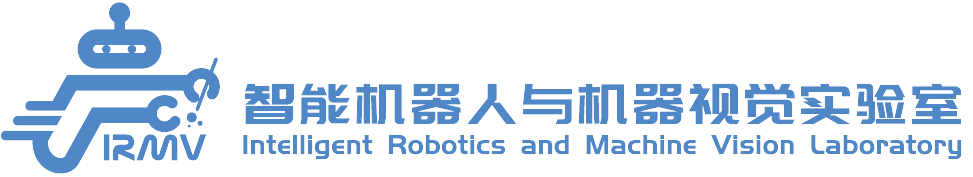
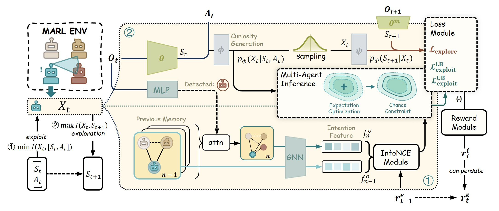

<div align=left>
    
</div>

<h1 style="text-align: center;">Wonder Wins Ways: Curiosity-Driven Exploration through Multi-Agent Contextual Calibration</h1>

[](https://arxiv.org/abs/2509.20648)
[](https://github.com/your-repo/CERMIC)
[](https://www.python.org/downloads/release/python-390/)
[](https://github.com/facebookresearch/BenchMARL)

## 📋 TODO

- ✅ Completed


- 🔄 In Progress
1. Release complete code repository
2. Release optimal checkpoints
3. Add comprehensive documentation and tutorials

## 🗂️ Navigation

- [📝 Abstract](#-abstract)
- [✨ Key Features](#-key-features)
- [📚 Citation](#-citation)
- [🙏 Acknowledgments](#-acknowledgments)

## 📝 Abstract

> Autonomous exploration in complex multi-agent reinforcement learning (MARL) with sparse rewards critically depends on providing agents with effective intrinsic motivation. While artificial curiosity offers a powerful self-supervised signal, it often confuses environmental stochasticity with meaningful novelty. Moreover, existing curiosity mechanisms exhibit a uniform novelty bias, treating all unexpected observations equally. However, peer behavior novelty, which encode latent task dynamics, are often overlooked, resulting in suboptimal exploration in decentralized, communication-free MARL settings. To this end, inspired by how human children adaptively calibrate their own exploratory behaviors via observing peers, we propose a novel approach to enhance multi-agent exploration. We introduce CERMIC, a principled framework that empowers agents to robustly filter noisy surprise signals and guide exploration by dynamically calibrating their intrinsic curiosity with inferred multi-agent context. Additionally, CERMIC generates theoretically-grounded intrinsic rewards, encouraging agents to explore state transitions with high information gain. We evaluate CERMIC on benchmark suites including VMAS, Meltingpot, and SMACv2. Empirical results demonstrate that exploration with CERMIC significantly outperforms SoTA algorithms in sparse-reward environments.



## ✨ Key Features

- **Socially Contextualized Curiosity**: CERMIC empowers MARL agents with socially contextualized curiosity, offering a novel perspective on effective exploration in sparse-reward settings inspired by developmental psychology
- **Robust Multi-Agent Calibration**: Features a robust and controllable multi-agent calibration mechanism for challenging partially observable and communication-limited environments, with adaptive tuning based on learned reliability of the intention graph
- **Exploration Stability**: Effectively dampens exploration instability often plaguing vanilla novelty-seeking agents through contextual calibration
- **Lightweight Integration**: Delivered as a lightweight, readily integrable module that demonstrates consistent gains over strong baselines across standard benchmarks under sparse rewards
- **State-of-the-Art Performance**: Significantly outperforms SoTA algorithms in sparse-reward environments

> **Note**: Code and implementation details will be released soon. Stay tuned for updates!

## 📚 Citation

If you find this work useful, please cite our paper:

```BibTeX
@article{pan2025wonder,
  title={Wonder Wins Ways: Curiosity-Driven Exploration through Multi-Agent Contextual Calibration},
  author={Pan, Yiyuan and Liu, Zhe and Wang, Hesheng},
  journal={arXiv preprint arXiv:2509.20648},
  year={2025}
}
```

## 🙏 Acknowledgments

This repository is built upon [BenchMARL](https://github.com/facebookresearch/BenchMARL) and integrates with multiple multi-agent environments including [VMAS](https://github.com/proroklab/VectorizedMultiAgentSimulator), [Meltingpot](https://github.com/deepmind/meltingpot), and [SMACv2](https://github.com/oxwhirl/smacv2). We thank the authors for their excellent work and for making their code publicly available.

This project is licensed under the MIT License - see the [LICENSE](LICENSE) file for details.
